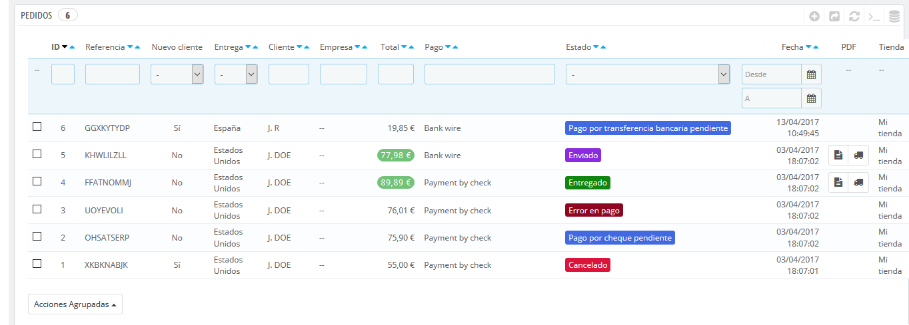

[⬅️ Volver](index.md#prestashop-doc) <!-- Enlace de regreso -->

# Gestión de pedidos 📦

La página de **Pedidos**, accesible desde el menú principal, muestra toda la información relacionada con las ventas de tu tienda. Los pedidos se organizan por fecha, desde el más reciente hasta el más antiguo.

## Funcionalidades Principales ⚙️ 

  
📋 Funcionalidades clave para la gestión de pedidos

  - **Filtrar pedidos**: Usa el campo de búsqueda en la parte superior para encontrar pedidos específicos. Por ejemplo, escribe "Doe" en el campo **Cliente** y haz clic en **Filtrar**.
  - **Exportar pedidos**: Descarga la lista completa de pedidos haciendo clic en **Exportar** en la barra superior.

  > **Nota importante**: No se pueden **eliminar pedidos** en PrestaShop debido a regulaciones legales en Europa.

  > **Recordatorio**: PrestaShop **no permite importar pedidos**.

  

## Crear un pedido ➕ 

  
🛒 Crear un pedido desde el back-office

  PrestaShop permite crear un pedido desde el back-office, útil cuando un cliente necesita ayuda para completar su compra.

  1. **Añadir nuevo pedido**: Haz clic en "Añadir nuevo pedido" y busca al cliente por nombre, apellido o email. Si el cliente no tiene cuenta, usa el botón "Añadir cliente" para crear una nueva.
  2. **Seleccionar dirección**: Asegúrate de registrar la dirección del cliente. Usa "Añadir nueva dirección" si es necesario.
  3. **Elegir productos**: Busca productos y agrégalos al carrito. Puedes elegir combinaciones de productos y ver el stock disponible para informar al cliente.
  4. **Aplicar descuento**: Añade un cupón de descuento o crea uno nuevo si es necesario.
  5. **Dirección de envío y facturación**: Selecciona las direcciones para el envío y la facturación, o crea nuevas según sea necesario.

